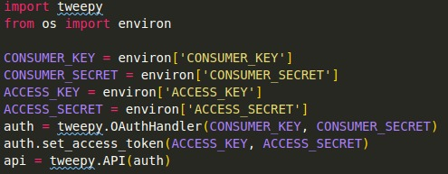
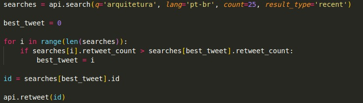

# Bot sobre arquitetura para Twitter

Bot sobre arquitetura para Twitter é um bot feito em Python com o uso da biblioteca <a href="https://www.tweepy.org/">Tweepy</a>. Este bot procura entre os tweets mais recentes quais são os relacionados a arquitetura e seleciona o que recebeu mais retweets.

## Como ele funciona?

Primeiro devemos colocar as keys da API do Twitter. Aqui em usei o environ, da biblioteca os, para setar as keys como variáveis ambientais, já que não quero que outras pessoas tenham acesso a esses dados sensíveis.

Depois disto, programei uma search query com o termo que usei como base, que linguagem eu quero filtrar, quantos tweets quero coletar e qual o tipo de pesquisa o script deve realizar.

Com o resultado desta pesquisa, programei um for loop para pegar o id do tweet que recebeu mais retweets. Para finalizar o script, mandei que o mesmo retweetasse o tweet com o id que saiu do loop.

